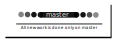
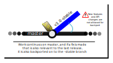

# lws release policy

## Master branch

Master branch is the default and all new work happens there.  It's unstable and
subject to history rewrites, patches moving about and being squashed etc.  In
terms of it working, it is subject to passing CI tests including a battery of
runtime tests, so if it is passing CI as it usually is then it's probably in
usable shape.



If you have patches (you are a hero) they should be targeted at master.

To follow such a branch, `git pull` is the wrong tool... the starting point
of what you currently have may no longer exist remotely due to rearranging the
patches there.  Instead use a flow like this:

```
 $ git fetch https://libwebsockets.org/repo/libwebsockets +master:m && git reset --hard m
```

This fetches current remote master into local branch `m`, and then forces your
local checkout to exactly match `m`.  This replaces your checked-out tree
including any of your local changes, so stash those first, or use stgit or so
to pop them before updating your basis against lws master.

## Stable branches

Master is very useful for coordinating development, and integrating WIP,
but for distros or integration into large user projects some stability is often
more desirable than the latest development work.

Periodically, when master seems in good shape and various new developments seem
to be working, it's copied out into a versioned stable branch, like `v3.0-stable`.


The initial copy is tagged with, eg, `v3.0.0`.

(At that time, master's logical version is set to "...99", eg, `v3.0.99` so
version comparisons show that version of master is "later" than any other
v3.0 version, which will never reach 99 point releases itself, but "earlier"
than, eg, v3.1.)

## Backport policy

Work continues on master, and as part of that usually bugs are reported and / or
fixes found that may apply not just to current master, but the version of master
that was copied to form the last -stable branch.

In that case, the patch may be backported to the last stable branch to also fix
the bug there.  In the case of refactors or major internal improvements, these
typically do not get backported.

This applies only to fixes and public API-neutral internal changes to lws... if
new features were backported or API changes allowed, then there would be
multiple apis under the same version name and library soname, which is
madness.

When new stable releases are made, the soname is bumped reflecting the API is
different than that of previous versions.



If there is something you need in a later lws version that is not backported,
you need to either backport it yourself or use a later lws version.
Using a more recent version of lws (and contributing fixes and changes so you
yourself can get them easily as well as contributing for others) is almost
always the correct way.

## Stable point releases

Periodically fix patches pile up on the -stable branch and are tagged out as
"point releases".  So if the original stable release was "v3.0.0", the point
release may be "v3.0.1".


## Critical fixes

Sometimes a bug is found and fixed that had been hiding for a few versions.
If the bug has some security dimension or is otherwise important, we may
backport it to a few recent releases, not just the last one.  This is pretty
uncommon though.


